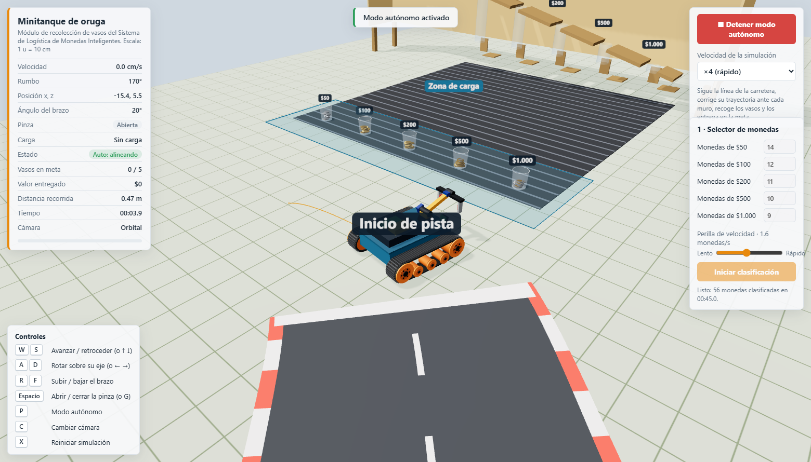
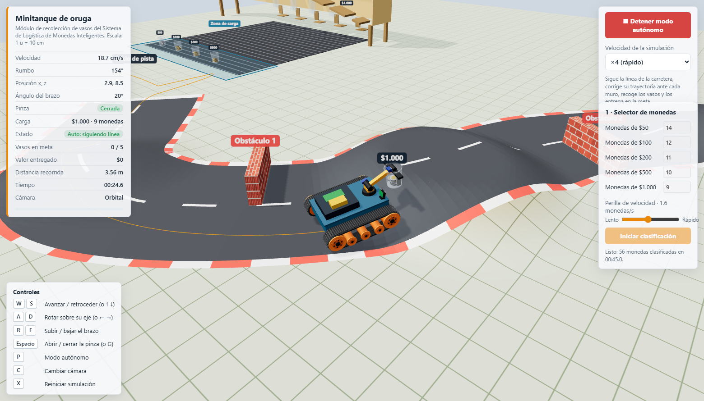
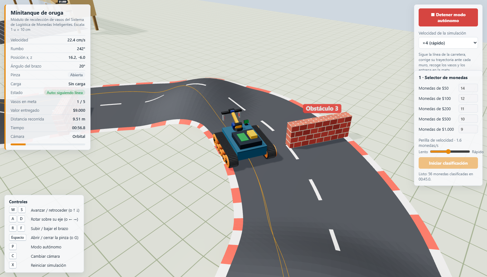
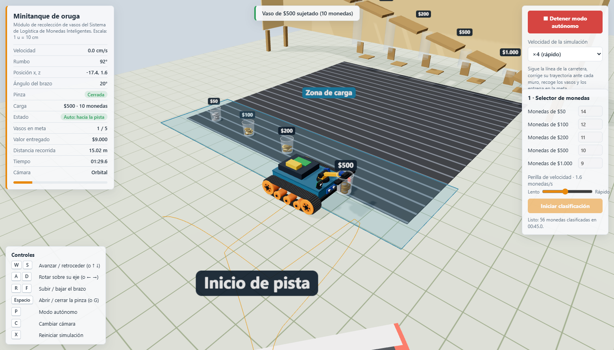
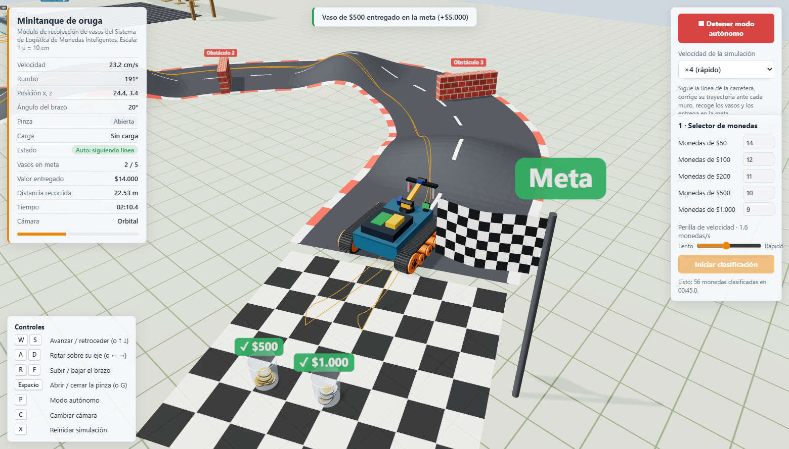
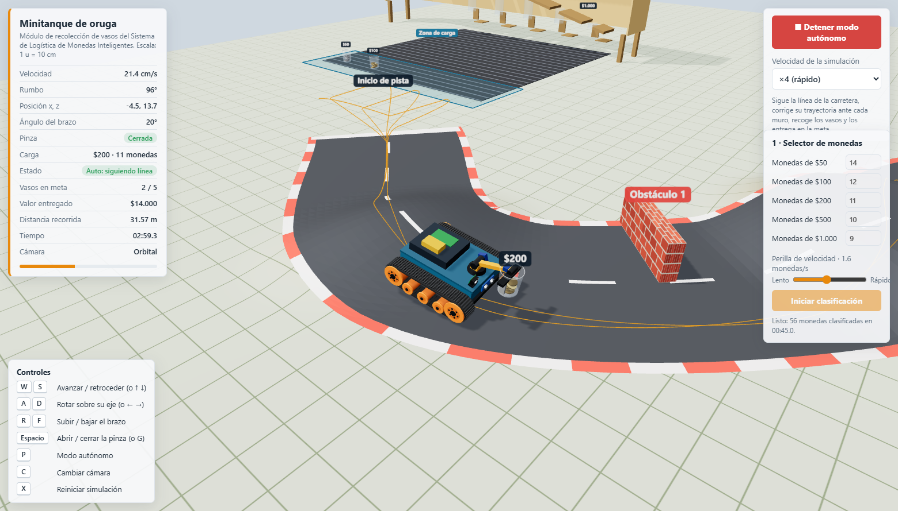

# Minitanque de oruga - Logística de monedas inteligentes

Este documento recoge una secuencia real de funcionamiento del minitanque de oruga a partir de la simulación original en `minitanque (1).html`. La simulación modela un robot móvil que:

- clasifica monedas por valor,
- prepara paquetes en vasos,
- recoge cada vaso con su pinza,
- sigue la carretera y evita obstáculos,
- entrega la carga en la meta,
- calcula el valor total entregado.

## 1. Visión general del sistema

La escena inicia con el minitanque en la zona de carga, a la izquierda de la pista, mientras los vasos con diferentes valores de moneda quedan listos para ser clasificados. La ruta principal se desarrolla en una carretera con obstáculos y una meta final donde se entregan los vasos.

### Descripción
La imagen muestra la preparación del sistema antes de que el robot se ponga en marcha. La zona de carga está visible, los vasos ya tienen sus valores separados y el tanque queda alineado para arrancar la operación.

---

## 2. Inicio del modo autónomo

Al activar el modo autónomo, el minitanque toma la decisión de orientarse hacia la pista y seguir la trayectoria prevista. En este punto se activa la lógica de localización, enfoque de la carretera y ajuste frente a los obstáculos.

### Descripción
El robot deja la zona de carga, se orienta hacia la carretera y comienza a seguir la línea principal. La lógica del algoritmo intenta mantener el vehículo centrado mientras corrige su rumbo frente a muros y variaciones del trazado.

---

## 3. Aproximación a la zona de recogida

El robot se desplaza con rumbo hacia los vasos y se prepara para la recogida. Aquí comienza la fase más importante de la manipulación: acercarse con precisión y mantener el brazo y la pinza en posición adecuada.

### Descripción
El tanque ya ha avanzado por la pista y se aproxima al conjunto de vasos. La escena evidencia el proceso de alineación del brazo para llegar al punto adecuado y cerrar la pinza con máxima precisión.

---

## 4. Recogida del vaso

En esta etapa el brazo baja, la pinza cierra y el robot adquiere la carga. La operación es crítica porque debe sostener el vaso sin desalinearse ni perder el equilibrio durante el transporte.

### Descripción
El minitanque se para junto al vaso, el brazo desciende y la pinza se cierra. Esto indica que la carga ya está asegurada y lista para ser transportada hasta la meta.

---

## 5. Transporte hacia la meta

Una vez que el vaso queda sujeto, el robot sigue la carretera con la carga y se desplaza hacia la zona de entrega. Durante este tramo, la simulación muestra la estabilidad del transporte y la capacidad de seguir la ruta sin perder la carga.

### Descripción
El vehículo ya lleva la carga en su pinza y avanza hacia la meta. La escena muestra que la carga se mantiene segura mientras la trayectoria sigue la carretera y se evita el conflicto con los muros.

---

## 6. Entrega en la meta

La fase final del proceso consiste en llegar a la meta, alinear el robot y soltar el vaso en la zona de destino. El controlador registra la entrega y acumula el valor correspondiente.

### Descripción
El robot llega a la zona de entrega, alinea la pinza con la meta y libera la carga. La entrega se confirma y el valor del vaso se incorpora al total acumulado por la simulación.

---

## 7. Misión completada

Cuando todos los vasos han sido entregados, la simulación concluye con la misión completada. En este punto el sistema informará el valor total entregado, la distancia recorrida y el tiempo total de operación.

### Descripción
La pantalla final muestra la operación terminada con todas las entregas completadas. La misión deja constancia de que el sistema cumplió el objetivo completo de clasificación, transporte y entrega.

---

## 8. Resumen funcional

La secuencia del sistema queda reflejada de esta forma:

1. Preparación y clasificación de monedas en los vasos.
2. Activación del modo autónomo.
3. Aproximación del robot a la carga.
4. Cierre de la pinza y recogida del vaso.
5. Traslado por la carretera hacia la meta.
6. Entrega final y cierre de misión.

Esto permite observar de forma visual cómo el robot transforma una operación de clasificación en un ciclo completo de logística automatizada.

## 9. Controles de la simulación

- W / S: avanzar y retroceder
- A / D: girar sobre su eje
- R / F: subir y bajar el brazo
- Espacio: abrir/cerrar pinza
- P: activar modo autónomo
- C: cambiar cámara
- X: reiniciar simulación

---

## 10. Observación final

La secuencia ordenada de imágenes permite documentar el comportamiento del robot de manera clara y didáctica. El flujo del sistema está bien representado en etapas diferenciadas y resulta útil tanto para explicación técnica como para presentaciones visuales.
